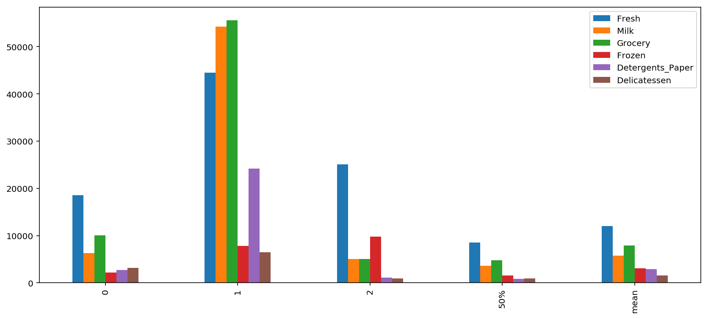
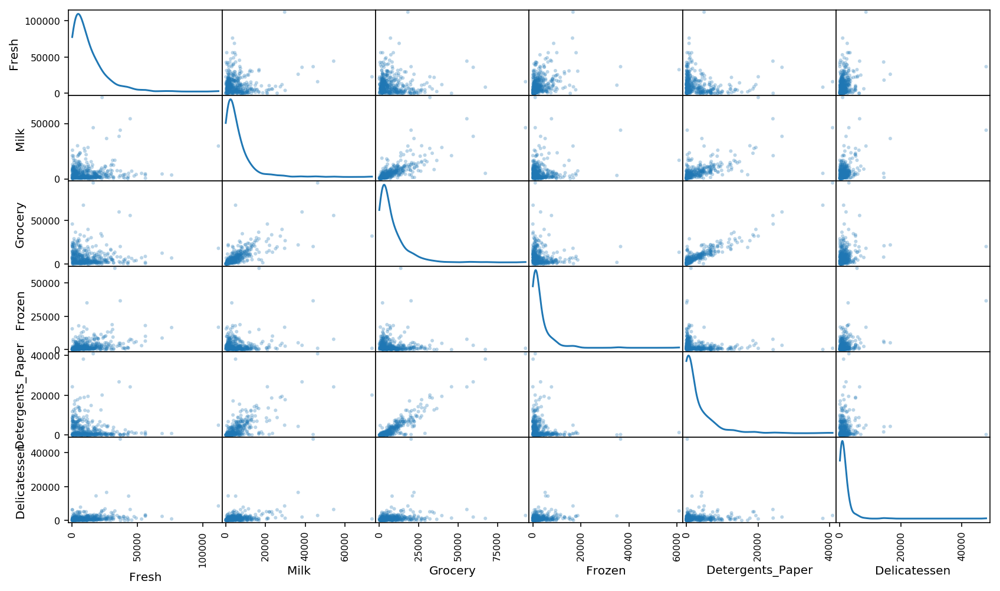
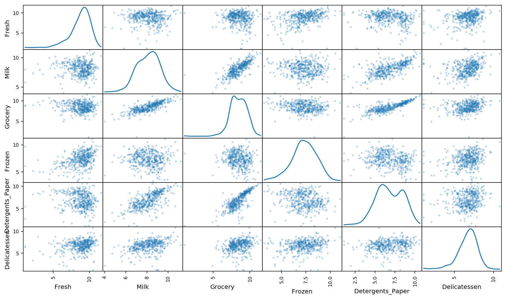
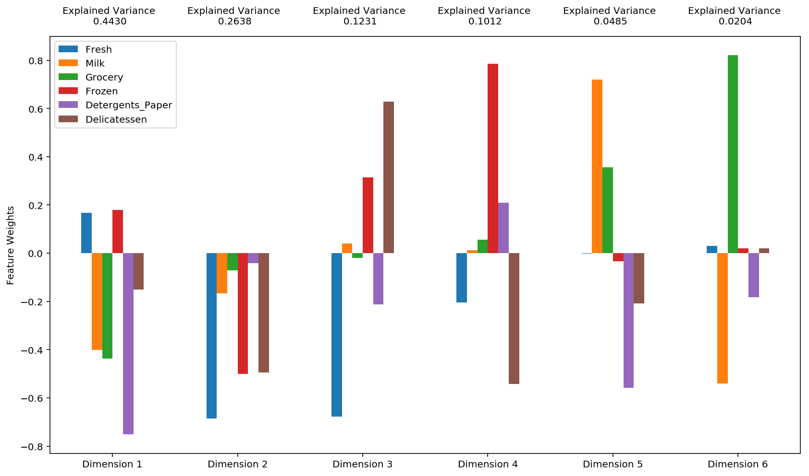
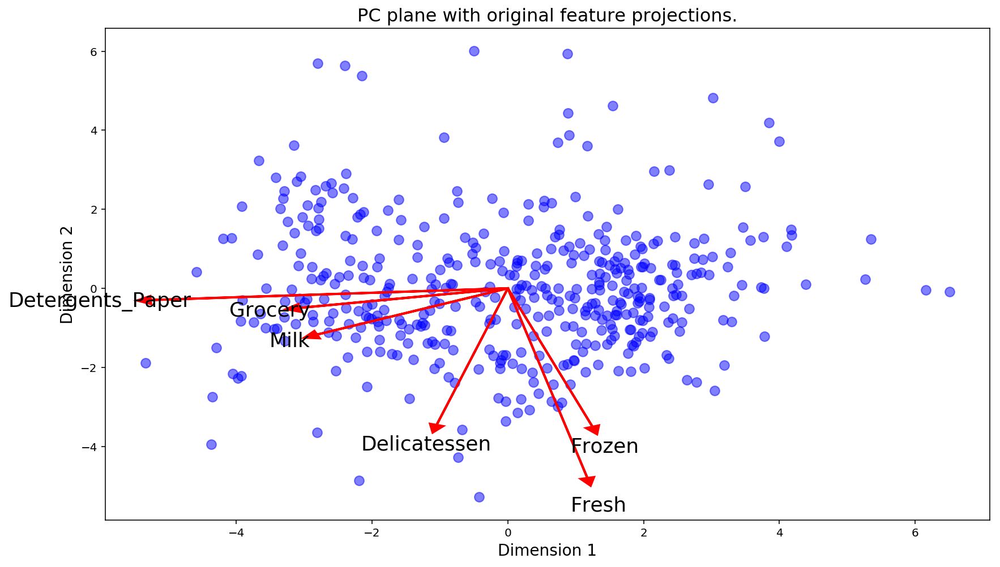
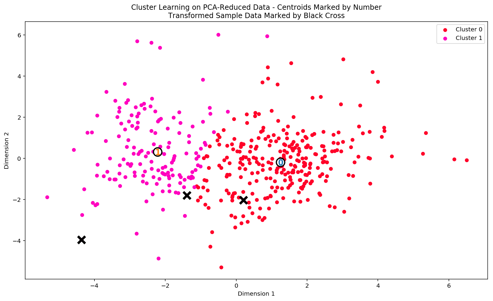
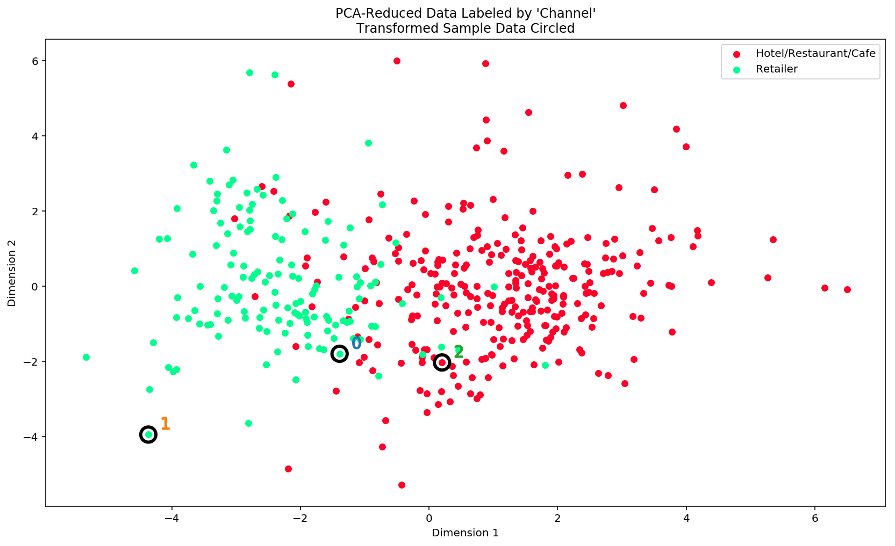

##  创建用户分类

近日，一家批发经销商尝试着针对一些客户改变其发货方式，从原来的每周五次每次早上发货，改为了更为便宜的每周三次每次晚上发货。起初，发货方式的改变并没有带来任何显著的负面结果，于是该批发商将这一更为便宜的变动推广到了所有客户。几乎同一时刻，该批发商开始收到客户对发货服务变动的投诉，也有的客户开始取消提货。该批发商受到的损失比节省下来的钱还要多。现在，需要一个算法来根据客户特征和信息，将客户细分为不同的类别，以帮助经销商在未来做出更加明智的商业决策。所以现在的任务就是利用非监督学习技术，看看客户之间存在哪些相似之处，以及如何以最佳的方式将客户细分为不同类别。（注意：我们只是使用非监督学习算法来对客户进行聚类，经销商可以根据这个聚类来提供具体的发货策略，但是这个具体的策略是怎么样的，我们在做完了聚类任务后会介绍一下，但是并不会太深入，因为这并不是我们主要关心的）

## begin

在这个项目中，我们将分析一个数据集的内在结构，这个数据集包含很多客户针对不同类型产品的年度采购额（用**金额**表示）。这个项目的任务之一是如何最好地描述一个批发商不同种类顾客之间的差异。这样做将能够使得批发商能够更好的组织他们的物流服务以满足每个客户的需求。

这个项目的数据集能够在[UCI机器学习信息库](https://archive.ics.uci.edu/ml/datasets/Wholesale+customers)中找到.


```python
# 引入这个项目需要的库
import numpy as np
import pandas as pd
import visuals as vs
from IPython.display import display # 使得我们可以对DataFrame使用display()函数

# 设置以内联的形式显示matplotlib绘制的图片（在notebook中显示更美观）
%matplotlib inline

# 载入整个客户数据集
try:
    data = pd.read_csv("customers.csv")
    data.drop(['Region', 'Channel'], axis = 1, inplace = True)    ## 这两个特征为无关特征，我们直接去掉
    print "Wholesale customers dataset has {} samples with {} features each.".format(*data.shape)
except:
    print "Dataset could not be loaded. Is the dataset missing?"
```

    Wholesale customers dataset has 440 samples with 6 features each.


## 分析数据
在这部分，将开始分析数据，通过可视化和代码来理解每一个特征和其他特征的联系。我们会看到关于数据集的统计描述，考虑每一个属性的相关性，然后从数据集中选择若干个样本数据点，我们将在整个项目中一直跟踪研究这几个数据点。

运行下面的代码单元给出数据集的一个统计描述。注意这个数据集包含了6个重要的产品类型：**'Fresh'**, **'Milk'**, **'Grocery'**, **'Frozen'**, **'Detergents_Paper'**和 **'Delicatessen'**。分别代表生鲜，牛奶，杂货，冷冻，清洁剂，熟食


```python
# 显示数据集的一个描述
display(data.describe())
```


<div>
<style scoped>
    .dataframe tbody tr th:only-of-type {
        vertical-align: middle;
    }

    .dataframe tbody tr th {
        vertical-align: top;
    }

    .dataframe thead th {
        text-align: right;
    }
</style>
<table border="1" class="dataframe">
  <thead>
    <tr style="text-align: right;">
      <th></th>
      <th>Fresh</th>
      <th>Milk</th>
      <th>Grocery</th>
      <th>Frozen</th>
      <th>Detergents_Paper</th>
      <th>Delicatessen</th>
    </tr>
  </thead>
  <tbody>
    <tr>
      <th>count</th>
      <td>440.000000</td>
      <td>440.000000</td>
      <td>440.000000</td>
      <td>440.000000</td>
      <td>440.000000</td>
      <td>440.000000</td>
    </tr>
    <tr>
      <th>mean</th>
      <td>12000.297727</td>
      <td>5796.265909</td>
      <td>7951.277273</td>
      <td>3071.931818</td>
      <td>2881.493182</td>
      <td>1524.870455</td>
    </tr>
    <tr>
      <th>std</th>
      <td>12647.328865</td>
      <td>7380.377175</td>
      <td>9503.162829</td>
      <td>4854.673333</td>
      <td>4767.854448</td>
      <td>2820.105937</td>
    </tr>
    <tr>
      <th>min</th>
      <td>3.000000</td>
      <td>55.000000</td>
      <td>3.000000</td>
      <td>25.000000</td>
      <td>3.000000</td>
      <td>3.000000</td>
    </tr>
    <tr>
      <th>25%</th>
      <td>3127.750000</td>
      <td>1533.000000</td>
      <td>2153.000000</td>
      <td>742.250000</td>
      <td>256.750000</td>
      <td>408.250000</td>
    </tr>
    <tr>
      <th>50%</th>
      <td>8504.000000</td>
      <td>3627.000000</td>
      <td>4755.500000</td>
      <td>1526.000000</td>
      <td>816.500000</td>
      <td>965.500000</td>
    </tr>
    <tr>
      <th>75%</th>
      <td>16933.750000</td>
      <td>7190.250000</td>
      <td>10655.750000</td>
      <td>3554.250000</td>
      <td>3922.000000</td>
      <td>1820.250000</td>
    </tr>
    <tr>
      <th>max</th>
      <td>112151.000000</td>
      <td>73498.000000</td>
      <td>92780.000000</td>
      <td>60869.000000</td>
      <td>40827.000000</td>
      <td>47943.000000</td>
    </tr>
  </tbody>
</table>
</div>


###  选择样本
为了对客户有一个更好的了解，并且了解代表他们的数据将会在这个分析过程中如何变换。最好是选择几个样本数据点，并且更为详细地分析它们。在下面的代码单元中，选择**三个**索引加入到索引列表`indices`中，这三个索引代表我们要追踪的客户。建议是找到三个最不相同的客户


```python
# 从数据集中选择三个你希望抽样的数据点的索引
indices = [18,47,406]

# 为选择的样本建立一个DataFrame
samples = pd.DataFrame(data.loc[indices], columns = data.keys()).reset_index(drop = True)
print "Chosen samples of wholesale customers dataset:"
display(samples)


import seaborn as sns
%config InlineBackend.figure_format = 'retina'

import seaborn as sns
samples_bar = samples.append(data.describe().loc['50%'])
samples_bar = samples_bar.append(data.describe().loc['mean'])
samples_bar.plot(kind='bar', figsize=(14,6))
```

    Chosen samples of wholesale customers dataset:


<div>
<style scoped>
    .dataframe tbody tr th:only-of-type {
        vertical-align: middle;
    }

    .dataframe tbody tr th {
        vertical-align: top;
    }

    .dataframe thead th {
        text-align: right;
    }
</style>
<table border="1" class="dataframe">
  <thead>
    <tr style="text-align: right;">
      <th></th>
      <th>Fresh</th>
      <th>Milk</th>
      <th>Grocery</th>
      <th>Frozen</th>
      <th>Detergents_Paper</th>
      <th>Delicatessen</th>
    </tr>
  </thead>
  <tbody>
    <tr>
      <th>0</th>
      <td>18601</td>
      <td>6327</td>
      <td>10099</td>
      <td>2205</td>
      <td>2767</td>
      <td>3181</td>
    </tr>
    <tr>
      <th>1</th>
      <td>44466</td>
      <td>54259</td>
      <td>55571</td>
      <td>7782</td>
      <td>24171</td>
      <td>6465</td>
    </tr>
    <tr>
      <th>2</th>
      <td>25066</td>
      <td>5010</td>
      <td>5026</td>
      <td>9806</td>
      <td>1092</td>
      <td>960</td>
    </tr>
  </tbody>
</table>
</div>


    <matplotlib.axes._subplots.AxesSubplot at 0x7f0ce42fc750>





以下分析均基于上图中的各个消费类型的中位数和平均值。

1,第一个客户属于杂货店，因为其牛奶，杂货，清洁剂明显高于各自的平均值以及中位数，并且该客户的牛奶，杂货，清洁剂的开销在整体数据集中属于中上水平，应该属于规模中上的杂货店。

2，第二个客户明显属于大型超市，因为该客户在生鲜牛奶杂货以及清洁剂方面的开销明显高于熟食和冷冻商品，这也是大型超市的特点。并且熟食和冷冻商品相对于其他客户也是属于Q3以上的水平，也是大型超市相对于其他类型企业的特点。

3，第三个客户属于餐馆，其生鲜冷冻种类的消费明显高于平均值以及中位数，牛奶杂货处于平均值以下水平，因为餐馆也有这一类产品的需求，但是量不大，并且清洁剂的使用相对于其他客户也不会太少，由于食品都是自己做的，所以熟食需求会比较少。

### 特征相关性
一个有趣的想法是，考虑这六个类别中的一个（或者多个）产品类别，是否对于理解客户的购买行为具有实际的相关性。也就是说，当用户购买了一定数量的某一类产品，我们是否能够确定他们必然会成比例地购买另一种类的产品。有一个简单的方法可以检测相关性：我们用移除了某一个特征之后的数据集来构建一个监督学习（回归）模型，然后用这个模型去预测那个被移除的特征，再对这个预测结果进行评分，看看预测结果如何。如果预测分数高，是不是就意味着这个特征没有存在的必要呢？


```python
from sklearn.model_selection import train_test_split
from sklearn.tree import DecisionTreeRegressor

# 为DataFrame创建一个副本，用'drop'函数丢弃一个特征
new_data = data.drop(['Detergents_Paper'],axis=1)

# 使用给定的特征作为目标，将数据分割成训练集和测试集
X_train, X_test, y_train, y_test = train_test_split(new_data, data.loc[:,'Detergents_Paper'], test_size=0.25, random_state=0)

# 创建一个DecisionTreeRegressor（决策树回归器）并在训练集上训练它
regressor = DecisionTreeRegressor(random_state=0)
regressor.fit(X_train, y_train)

# 输出在测试集上的预测得分
score = regressor.score(X_test, y_test)

print score
```

    0.7286551812541454


其实我尝试了所有的特征，发现Detergents_Paper这个的预测得分/决定系数最高（决定系数代表了回归任务的拟合程度1代表最好，0代表最差），为0.73左右，说明Detergents Paper这个特征是可以有其他特征的某种组合而推导出来，与其他特征具有相关性。既然有这样的结论，那么说明该特征对于区分用户消费习惯来说不太重要，因为该特征可以由其他特征推导出来。

### 可视化特征分布
为了能够对这个数据集有一个更好的理解，我们可以对数据集中的每一个产品特征构建一个散布矩阵（scatter matrix）。如果你发现你在上面尝试预测的特征对于区分一个特定的用户来说是必须的（也就是这个特征无法被其他特征代替，也就和其他特征相关性小），那么这个特征和其它的特征可能不会在下面的散射矩阵中显示任何关系。相反的，如果你认为这个特征对于识别一个特定的客户是没有作用的，那么通过散布矩阵可以看出在这个数据特征和其它特征中有关联性。运行下面的代码以创建一个散布矩阵。


```python
# 对于数据中的每一对特征构造一个散布矩阵
pd.plotting.scatter_matrix(data, alpha = 0.3, figsize = (14,8), diagonal = 'kde');
```





由上图可以看出，杂货和清洁纸以及杂货和牛奶这两组特征之间存在比较高的相关性，这个结果验证了上一问的结论，清洁纸同杂货有比较高的相关性，也很正常，因为杂货毕竟包含了清洁纸。散布矩阵的对角线呈现了每一特征的分布，可以看见这些分布大致呈一个偏斜的钟型，并不是严格的对称，属于偏态分布并不是正太分布。大多数的数据点大多都分布在0-10000的范围内。

## 数据预处理
在这个部分，我们将通过在数据上做一个合适的缩放（因为上图已经检测出了特征的偏斜），并检测异常点（可以选择性移除）将数据预处理成一个更好的代表客户的形式。预处理数据是保证分析中能够得到显著且有意义的结果的重要环节。

### 特征缩放
如果数据不是正态分布的，尤其是数据的平均数和中位数相差很大的时候（表示数据非常歪斜）。这时候通常用一个非线性的缩放是比较好的。一种实现这个缩放的方法是使用Box-Cox 变换，这个方法能够计算出能够最佳减小数据倾斜的指数变换方法。一个比较简单的并且在大多数情况下都适用的方法是使用自然对数。


```python
# TODO：使用自然对数缩放数据
log_data = np.log(data)

# TODO：使用自然对数缩放样本数据
log_samples = np.log(samples)

# 为每一对新产生的特征制作一个散射矩阵
pd.plotting.scatter_matrix(log_data, alpha = 0.3, figsize = (14,8), diagonal = 'kde');
```





### 观察
在使用了一个自然对数的缩放之后，数据的各个特征会显得更加的正态分布。对于之前发现的相关关系的特征对，观察他们的相关关系还是存在的，并且似乎是变强了。


```python
# 展示经过对数变换后的样本数据
display(log_samples)
```


<div>
<style scoped>
    .dataframe tbody tr th:only-of-type {
        vertical-align: middle;
    }

    .dataframe tbody tr th {
        vertical-align: top;
    }

    .dataframe thead th {
        text-align: right;
    }
</style>
<table border="1" class="dataframe">
  <thead>
    <tr style="text-align: right;">
      <th></th>
      <th>Fresh</th>
      <th>Milk</th>
      <th>Grocery</th>
      <th>Frozen</th>
      <th>Detergents_Paper</th>
      <th>Delicatessen</th>
    </tr>
  </thead>
  <tbody>
    <tr>
      <th>0</th>
      <td>9.830971</td>
      <td>8.752581</td>
      <td>9.220192</td>
      <td>7.698483</td>
      <td>7.925519</td>
      <td>8.064951</td>
    </tr>
    <tr>
      <th>1</th>
      <td>10.702480</td>
      <td>10.901524</td>
      <td>10.925417</td>
      <td>8.959569</td>
      <td>10.092909</td>
      <td>8.774158</td>
    </tr>
    <tr>
      <th>2</th>
      <td>10.129268</td>
      <td>8.519191</td>
      <td>8.522380</td>
      <td>9.190750</td>
      <td>6.995766</td>
      <td>6.866933</td>
    </tr>
  </tbody>
</table>
</div>


### 异常值检测
对于任何的分析，在数据预处理的过程中检测数据中的异常值都是非常重要的一步。异常值的出现会使得把这些值考虑进去后结果出现倾斜。有很多关于怎样定义什么是数据集中的异常值的经验法则。这里我们将使用[Tukey的定义异常值的方法](http://datapigtechnologies.com/blog/index.php/highlighting-outliers-in-your-data-with-the-tukey-method/)：一个*异常阶（outlier step）*被定义成1.5倍的四分位距（interquartile range，IQR）。一个数据点如果某个特征包含在该特征的IQR之外的特征，那么该数据点被认定为异常点。异常值计算公式：

Value < Q1-1.5*IRQ

Value > Q3+1.5*IQR


```python
# 对于每一个特征，找到值异常高或者是异常低的数据点
tmp = []
for feature in log_data.keys():
    
    # TODO：计算给定特征的Q1（数据的25th分位点）
    Q1 = np.percentile(log_data[feature], 25)
    
    # TODO：计算给定特征的Q3（数据的75th分位点）
    Q3 = np.percentile(log_data[feature], 75)
    
    # TODO：使用四分位范围计算异常阶（1.5倍的四分位距）
    step = 1.5*(Q3-Q1)
    
    # 显示异常点
    print "Data points considered outliers for the feature '{}':".format(feature)
    #display(log_data[~((log_data[feature] >= Q1 - step) & (log_data[feature] <= Q3 + step))])
    tmp += (log_data[~(log_data[feature] >= Q1 - step) & (log_data[feature] <= Q3 + step)].index.tolist())

# 可选：选择你希望移除的数据点的索引
outliers  = []

# 请列出所有在多于一个特征下被看作是异常的数据点
outliers = list(set([i for i in tmp if tmp.count(i)>1]))

print log_data.iloc[outliers]

# 如果选择了的话，移除异常点
good_data = log_data.drop(log_data.index[outliers]).reset_index(drop = True)
```

    Data points considered outliers for the feature 'Fresh':
    Data points considered outliers for the feature 'Milk':
    Data points considered outliers for the feature 'Grocery':
    Data points considered outliers for the feature 'Frozen':
    Data points considered outliers for the feature 'Detergents_Paper':
    Data points considered outliers for the feature 'Delicatessen':
            Fresh      Milk    Grocery    Frozen  Detergents_Paper  Delicatessen
    128  4.941642  9.087834   8.248791  4.955827          6.967909      1.098612
    65   4.442651  9.950323  10.732651  3.583519         10.095388      7.260523
    66   2.197225  7.335634   8.911530  5.164786          8.151333      3.295837
    75   9.923192  7.036148   1.098612  8.390949          1.098612      6.882437
    154  6.432940  4.007333   4.919981  4.317488          1.945910      2.079442


上面打印出了多于一个特征下被看作是异常的数据点，我将他们的index放入了outliers当中。这些数据点应该被删除，应为这些异常点的不具有代表性，异常点过多还将导致算法出现过拟合等问题。

## 特征转换
在这个部分中我们将使用主成分分析（PCA）来分析批发商客户数据的内在结构。由于使用PCA在一个数据集上会计算出最大化方差的维度，我们将找出哪一个特征组合能够最好的描绘客户。

### 主成分分析（PCA）

既然数据被缩放到一个更加正态分布的范围中并且我们也移除了需要移除的异常点，我们现在就能够在`good_data`上使用PCA算法以发现数据的哪一个维度能够最大化特征的方差。除了找到这些维度，PCA也将报告每一个维度的*解释方差比（explained variance ratio）*--这个数据有多少方差能够用这个单独的维度来解释。注意PCA的一个组成部分（维度）能够被看做这个空间中的一个新的“特征”，但是它是原来数据中的特征构成的。


```python
from sklearn.decomposition import PCA

# 通过在good_data上使用PCA，将其转换成和当前特征数一样多的维度
pca = PCA(n_components=good_data.shape[1])
pca.fit(good_data)
# 使用上面的PCA拟合将变换施加在log_samples上
pca_samples = pca.transform(log_samples)

# 生成PCA的结果图
pca_results = vs.pca_results(good_data, pca)

print "First two components explained variance:{0}".format(sum(pca_results['Explained Variance'][:2]))
print "First four components explained variance:{0}".format(sum(pca_results['Explained Variance'][:4]))
```

    First two components explained variance:0.7068
    First four components explained variance:0.9311





在上图的可视化打印中，列出了每一个新的特征中，旧特征的分布情况（或者说旧特征对新特征的贡献）。“Dimension 1”代表新特征的第一维度，其上方的那个条形图代表旧特征到新特征的映射的权重，负的代表负的权重。接下来将对转换后的特征做一些简要的分析，看看这些个新特征看起来代表那些类型的顾客。

上图打印显示，数据的第一个和第二个主成分总共表达了0.7068的方差，前四个主成分总共表达了0.9311。
以下讨论称旧的特征为特征，新的特征为新特征。

第一个主成分：能代表杂货店的顾客。首先，第一个新特征/主成分受负的权值的影响最大，所以负的权值的代表的特征决定了顾客的类型，影响最大的特征分别为牛奶杂货清洁纸，这几个特征正相关。且通常没有生鲜和冷冻商品，和影响最大的特征负相关，综上所述，可能为杂货店。

第二个主成分：能代表餐馆的顾客。所有的特征均为正相关。并且冷冻生鲜熟食的占据主要比例，同时，餐馆也会有少量的牛奶，清洁纸和杂货的需求。所以，很明显是餐馆。

第三个主成分：第三个主成分比较尴尬，正负权重对主成分的影响力几乎相同。分析可以发现，熟食冷冻与生鲜清洁纸几乎到了水火不容的地步，该成分应该代表了两种类型的顾客，但是我想象不出来

第四个主成分：能代表速冻店的顾客。冷冻特征对主成分的影响较大，并且极大可能没有熟食（速冻店是不卖熟食的）。

### 观察
查看经过对数转换的样本数据在进行一个6个维度的主成分分析（PCA）之后会如何改变。观察样本数据的前四个维度的数值。考虑这和我们初始对样本点的解释是否一致。


```python
# 展示经过PCA转换的sample log-data
display(pd.DataFrame(np.round(pca_samples, 4), columns = pca_results.index.values))
```


<div>
<style scoped>
    .dataframe tbody tr th:only-of-type {
        vertical-align: middle;
    }

    .dataframe tbody tr th {
        vertical-align: top;
    }

    .dataframe thead th {
        text-align: right;
    }
</style>
<table border="1" class="dataframe">
  <thead>
    <tr style="text-align: right;">
      <th></th>
      <th>Dimension 1</th>
      <th>Dimension 2</th>
      <th>Dimension 3</th>
      <th>Dimension 4</th>
      <th>Dimension 5</th>
      <th>Dimension 6</th>
    </tr>
  </thead>
  <tbody>
    <tr>
      <th>0</th>
      <td>-1.3906</td>
      <td>-1.8004</td>
      <td>0.0301</td>
      <td>-0.3807</td>
      <td>-0.2116</td>
      <td>0.1467</td>
    </tr>
    <tr>
      <th>1</th>
      <td>-4.3646</td>
      <td>-3.9519</td>
      <td>-0.1229</td>
      <td>0.6240</td>
      <td>0.5379</td>
      <td>0.0551</td>
    </tr>
    <tr>
      <th>2</th>
      <td>0.2029</td>
      <td>-2.0321</td>
      <td>-0.2538</td>
      <td>1.1435</td>
      <td>0.0919</td>
      <td>-0.1145</td>
    </tr>
  </tbody>
</table>
</div>


当使用主成分分析的时候，一个主要的目的是减少数据的维度，这实际上降低了问题的复杂度。当然降维也是需要一定代价的：更少的维度能够表示的数据中的总方差更少。因为这个，*累计解释方差比（cumulative explained variance ratio）*对于我们确定这个问题需要多少维度非常重要。另外，如果大部分的方差都能够通过两个或者是三个维度进行表示的话，降维之后的数据能够被可视化。

所以我们现在尝试对原始数据进行降维，降低到2维的空间，便于观察。


```python
# 通过在good data上进行PCA，将其转换成两个维度
pca = PCA(n_components=2)
pca.fit(good_data)

# 使用上面训练的PCA将good data进行转换
reduced_data = pca.transform(good_data)

# 使用上面训练的PCA将log_samples进行转换
pca_samples = pca.transform(log_samples)

# 为降维后的数据创建一个DataFrame
reduced_data = pd.DataFrame(reduced_data, columns = ['Dimension 1', 'Dimension 2'])
```


```python
# 展示经过两个维度的PCA转换之后的样本log-data
display(pd.DataFrame(np.round(pca_samples, 4), columns = ['Dimension 1', 'Dimension 2']))
```


<div>
<style scoped>
    .dataframe tbody tr th:only-of-type {
        vertical-align: middle;
    }

    .dataframe tbody tr th {
        vertical-align: top;
    }

    .dataframe thead th {
        text-align: right;
    }
</style>
<table border="1" class="dataframe">
  <thead>
    <tr style="text-align: right;">
      <th></th>
      <th>Dimension 1</th>
      <th>Dimension 2</th>
    </tr>
  </thead>
  <tbody>
    <tr>
      <th>0</th>
      <td>-1.3906</td>
      <td>-1.8004</td>
    </tr>
    <tr>
      <th>1</th>
      <td>-4.3646</td>
      <td>-3.9519</td>
    </tr>
    <tr>
      <th>2</th>
      <td>0.2029</td>
      <td>-2.0321</td>
    </tr>
  </tbody>
</table>
</div>


### 观察
观察上面的打印，当仅仅使用两个维度进行PCA转换后，这里的结果与一个使用六个维度的PCA转换相比较时，前两维的数值是保持不变的。

## 可视化一个双标图（Biplot）
双标图是一个散点图，每个数据点的位置由它所在主成分的分数确定。坐标系是主成分（这里是`Dimension 1` 和 `Dimension 2`）。此外，双标图还展示出初始特征在主成分上的投影。一个双标图可以帮助我们理解降维后的数据，发现主成分和初始特征之间的关系。

运行下面的代码来创建一个降维后数据的双标图。


```python
# Create a biplot
vs.biplot(good_data, reduced_data, pca)
```


    <matplotlib.axes._subplots.AxesSubplot at 0x7f2fc75a3d50>





### 观察

一旦我们有了原始特征的投影（红色箭头），就能更加容易的理解散点图每个数据点的相对位置。

在这个双标图中，哪些初始特征与第一个主成分有强关联？哪些初始特征与第二个主成分相关联？你观察到的是否与之前得到的 pca_results 图相符？

## 聚类

在这个部分，我们选择使用K-Means聚类算法或者是高斯混合模型聚类算法以发现数据中隐藏的客户分类。然后，你将从簇中恢复一些特定的关键数据点，通过将它们转换回原始的维度和规模，从而理解他们的含义。

下面我将对选择K-Means和高斯混合模型这两个聚类算法做一个简单的分析，然后最终决定选择一个算法进行聚类

**回答:**
K-means的优点：

1，简单，实现容易，收敛较快

2，解释性强（基于距离）

3，调节参数少，一般调节K值

GMM的优点：

1，调节参数少，一般调节K值

2，最终结果是某个数据属于某个分类的概率，这是比较重要的信息

通过观察降维后的数据的散点图，可以大致观察出数据点大致分为两到三个簇，且有高斯分布的轮廓，所以我选择GMM算法来进行聚类。


### 创建聚类

针对不同情况，有些问题需要的聚类数目可能是已知的。但是在聚类数目不作为一个**先验**知道的情况下，我们并不能够保证某个聚类的数目对这个数据是最优的，因为我们对于数据的结构（如果存在的话）是不清楚的。但是，我们可以通过计算每一个簇中点的**轮廓系数**来衡量聚类的质量。数据点的[轮廓系数](http://scikit-learn.org/stable/modules/generated/sklearn.metrics.silhouette_score.html)衡量了它与分配给他的簇的相似度，这个值范围在-1（不相似）到1（相似）。**平均**轮廓系数为我们提供了一种简单地度量聚类质量的方法。


```python
from sklearn.mixture import GaussianMixture
from sklearn.metrics import silhouette_score

# 在降维后的数据上使用聚类算法
clusterer = GaussianMixture(n_components=2, random_state=0)
clusterer.fit(reduced_data)
# 预测每一个点的簇
preds = clusterer.predict(reduced_data)

# 找到聚类中心
centers = clusterer.means_

# 预测在每一个转换后的样本点的类
sample_preds = clusterer.predict(pca_samples)

# 计算选择的类别的平均轮廓系数（mean silhouette coefficient）
score = silhouette_score(reduced_data, preds)

print "silhouette socre of the prediction is %f" % (score)
```

    silhouette socre of the prediction is 0.421917


下面将展示不同的聚类数目下的平均轮廓系数

聚类数目2，轮廓系数：0.42

聚类数目3，轮廓系数：0.37

聚类数目4，轮廓系数：0.32

聚类数目5，轮廓系数：0.30

在所有的尝试中，只有聚类数目为2的时候，轮廓系数最佳，为0.421917，也符合之前的猜测。

### 聚类可视化
一旦选好了通过上面的评价函数得到的算法的最佳聚类数目，就能够通过使用下面的代码块可视化来得到的结果。作为实验，可以试着调整聚类算法的聚类的数量来看一下不同的可视化结果。


```python
# 从已有的实现中展示聚类的结果
vs.cluster_results(reduced_data, preds, centers, pca_samples)
```





###  数据恢复
上面的可视化图像中提供的每一个聚类都有一个中心点。这些中心（或者叫平均点）并不是数据中真实存在的点，但是是所有预测在这个簇中的数据点的*平均*。对于创建客户分类的问题，一个簇的中心对应于*那个分类的平均用户*。因为这个数据现在进行了降维并缩放到一定的范围，我们可以通过施加一个反向的转换恢复这个点所代表的用户的花费。

在下面的代码单元中，你将实现下列的功能：


```python
# 反向转换中心点
log_centers = pca.inverse_transform(centers)

# 对中心点做指数转换
true_centers = np.exp(log_centers)

# 显示真实的中心点
segments = ['Segment {}'.format(i) for i in range(0,len(centers))]
true_centers = pd.DataFrame(np.round(true_centers), columns = data.keys())
true_centers.index = segments
display(true_centers)
```


<div>
<style scoped>
    .dataframe tbody tr th:only-of-type {
        vertical-align: middle;
    }

    .dataframe tbody tr th {
        vertical-align: top;
    }

    .dataframe thead th {
        text-align: right;
    }
</style>
<table border="1" class="dataframe">
  <thead>
    <tr style="text-align: right;">
      <th></th>
      <th>Fresh</th>
      <th>Milk</th>
      <th>Grocery</th>
      <th>Frozen</th>
      <th>Detergents_Paper</th>
      <th>Delicatessen</th>
    </tr>
  </thead>
  <tbody>
    <tr>
      <th>Segment 0</th>
      <td>8953.0</td>
      <td>2114.0</td>
      <td>2765.0</td>
      <td>2075.0</td>
      <td>353.0</td>
      <td>732.0</td>
    </tr>
    <tr>
      <th>Segment 1</th>
      <td>3552.0</td>
      <td>7837.0</td>
      <td>12219.0</td>
      <td>870.0</td>
      <td>4696.0</td>
      <td>962.0</td>
    </tr>
  </tbody>
</table>
</div>


segment 0这个客户代表了餐饮类型的企业，因为其生鲜冷冻商品的花费在所有客户的花费中均居于75%以上水平，且其他与餐饮无关或者相关性较小的特征均居于50%以下的水平（由于delicatessen这个特征在这两个具有代表性的数据点中区别不是太大，所以不参与讨论），所以该客户代表了餐饮类型的企业。

segment 1这个客户代表了零售店或者杂货店之类的企业，因为其牛奶杂货清洁纸等商品的花费在所有客户的花费中均居于75%以上水平，且其他与餐饮无关或者相关性较小的特征均居于50%以下的水平，所以该客户代表了杂货店或者零售店类型的企业。

下面打印我们自己选择的样本点被分配到了那个聚类，结合我们之前的猜测和上面对每一个聚类中心的描述，看看我们之前的猜测是否正确。


```python
# 显示预测结果
for i, pred in enumerate(sample_preds):
    print "Sample point", i, "predicted to be in Cluster", pred
```

    Sample point 0 predicted to be in Cluster 1
    Sample point 1 predicted to be in Cluster 1
    Sample point 2 predicted to be in Cluster 0


**回答:**

三个样本点被分配到了两个簇里面去，其中第一个和第二个样本点分配到了同一个簇，第三个样本点被分配到了另一个簇。观察第三个样本点，其生鲜和冷冻具有明显的优势，所以应该属于segment 0所代表的簇，剩余两个点属于segment 1代表的簇。

## 结论

在最后一部分中，我们将探讨如何使用已经被聚类的数据。

### A/B test
在对他们的服务或者是产品做细微的改变的时候，公司经常会使用[A/B tests](https://en.wikipedia.org/wiki/A/B_testing)以确定这些改变会对客户产生积极作用还是消极作用。这个批发商希望考虑将他的派送服务从每周5天变为每周3天，但是他只会对他客户当中对此有积极反馈的客户采用。接下来我将做出一个策略，来获得客户的反馈，并分析出做出的发货改变对哪一种客户的影响最大。

简单地了解了一下AB测试，当供应商要对现有的服务做出改进（每周5天发货变为每周3天发货）的时候，需要进行A/B测试，方法就是将客户分为2组，且这两组客户的数量相等，客户的特征相似（也就是每一种类型的客户在2组中的数量都差不多），因为我们之前已经通过GMM将客户分为2类，为了在影响尽可能少的客户的前提下得出结论，我们并不对所有客户都进行测试，我们挑选的测试的客户均来自于两个簇的中心，现在从这两个簇的中心各取相等数量的客户作为测试客户，然后从测试客户中每一类各取50%的客户放入第一组，剩余的客户放入第二组，这样分组就完成了。接下来分别对这两组的客户采取不同的发货策略，第一组采用之前的发货策略，第二组采用新的发货策略。如果在接下来的时间内，两组客户收到的投诉很接近甚至第二组的客户的投诉量少于第一组，那么说明发货周期的更改策略是可行的。如果第二组客户的投诉大于第一组，那么说明该发货策略对所有或者某一类客户是有影响的。接下来就分析第二组客户中投诉客户的类型，如果两种类型的客户的投诉量差不多，说明该策略的更改对所有客户都有影响。如果某种类型的客户的投诉量明显高于另一种类型，那么策略的更改对于这一类客户的影响更大。

### 一个小小的尝试

其实在我们的原始数据中还有region这个参数，现在我们来做个小实验，应用监督学习算法，把region当做label，其他特征不变，来对region进行预测。我们将在特征中加入之前聚类的结果，也就是cluster这一项。看看有cluster特征和没有cluster对预测region有什么影响？


```python
from sklearn.ensemble import RandomForestClassifier
from sklearn.model_selection import train_test_split

# 读取包含聚类结果的数据
cluster_data = pd.read_csv("cluster.csv")
y = cluster_data['Region']
X = cluster_data.drop(['Region'], axis = 1)

# 划分训练集测试集
X_train, X_test, y_train, y_test = train_test_split(X, y, test_size=0.2, random_state=24)

clf = RandomForestClassifier(random_state=24)
clf.fit(X_train, y_train)
print "使用cluster特征的得分", clf.score(X_test, y_test)

# 移除cluster特征
X_train = X_train.copy()
X_train.drop(['cluster'], axis=1, inplace=True)
X_test = X_test.copy()
X_test.drop(['cluster'], axis=1, inplace=True)
clf.fit(X_train, y_train)
print "不使用cluster特征的得分", clf.score(X_test, y_test)
```

    使用cluster特征的得分 0.6666666666666666
    不使用cluster特征的得分 0.6436781609195402


以上试验分别使用包含cluster特征的数据和未包含cluster特征的数据来进行训练，结果显示，使用了cluster特征进行训练的模型效果要好于未使用cluster特征的模型，也就是说我们对数据进行聚类的步骤，对其他监督学习任务（预测客户来自于哪个区域）是有帮助的。猜测也许是因为来自于同一个区域的顾客，都拥有差不多的特征，也就是消费的数据都很相似，所以加上聚类信息对于区域的预测是有帮助的。但是从这个例子还无法看出，如果我们运行的监督学习算法是预测的其他特征，那是否还有效就不得而知了，也就是说无法知道加入了聚类信息的数据是否总是有利于监督学习算法

### 可视化内在的分布

在这个项目的开始，我们讨论了从数据集中移除`'Channel'`和`'Region'`特征，这样在分析过程中我们就会着重分析用户产品类别。
也就是说我们原始的数据中是有channel这个特征来指示客户的类别（呵呵，为了学习嘛，就去掉了标签），下面我们原始客户的聚类的散点图显示出来，看看和我们之前使用GMM算法聚类的结果是否有比较大的差异。


```python
# 根据‘Channel‘数据显示聚类的结果
vs.channel_results(reduced_data, outliers, pca_samples)
```





从上图可以看出，内在的分布分为2个簇，而我之前选择的也是两个簇。而且两个簇的类型也和我之前定义的一致。然后比较没有channel的聚类结果和实际的聚类，发现总体而言，GMM完成了聚类，将大部分的数据都正确区分开来了，但是我们可以发现，在绿色的簇所在的区域依然有很多红色的数据点，这种情况可以在GMM算法中表现出来，因为GMM算法是预测的某一个点属于某一个类的概率，这些在绿色区域的红色的点，我们的GMM算法认为其属于绿色的概率高于红色，所以将其归为绿色，但是如果我们将预测结果显示出来也可以看出这些点也有不小的概率为红色，但是像K-MEANS算法就无法获取这一类的信息，这也是GMM算法的优势之一。
